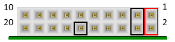

# User I/O

## User Push Buttons
## User LEDs
## DATA Headers (2x10pin)
EBAZ4205 provides three right-angle header connectors (2x10pin) that include 14 user I/O, VIN and ground signals as shown in picture. 

 
EBAZ4205 pinout (seen looking into the connector)

### Connector DATA1 
|Pin|Signal Name|Zynq pin |
|---|-----------|---------|
|1  |VCC-DATA1  |         |
|2  |VCC-DATA1  |         |
|3  |GND        |         |
|4  |GND        |         |
|5  |DATA1-5    |         |
|6  |DATA1-6    |         |
|7  |DATA1-7    |         |
|8  |DATA1-8    |         |
|9  |DATA1-9    |         |
|10 |NC         |         |
|11 |DATA1-11   |         |
|12 |GND        |         |
|13 |DATA1-13   |         |
|14 |DATA1-14   |         |
|15 |DATA1-15   |         |
|16 |DATA1-16   |         |
|17 |DATA1-17   |         |
|18 |DATA1-18   |         |
|19 |DATA1-19   |         |
|20 |DATA1-20   |         |

### Connector DATA2 
|Pin|Signal Name|Zynq pin |
|---|-----------|---------|
|1  |VCC-DATA2  |         |
|2  |VCC-DATA2  |         |
|3  |GND        |         |
|4  |GND        |         |
|5  |DATA2-5    |         |
|6  |DATA2-6    |         |
|7  |DATA2-7    |         |
|8  |DATA2-8    |         |
|9  |DATA2-9    |         |
|10 |NC         |         |
|11 |DATA2-11   |         |
|12 |GND        |         |
|13 |DATA2-13   |         |
|14 |DATA2-14   |         |
|15 |DATA2-15   |         |
|16 |DATA2-16   |         |
|17 |DATA2-17   |         |
|18 |DATA2-18   |         |
|19 |DATA2-19   |         |
|20 |DATA2-20   |         |

### Connector DATA3
|Pin|Signal Name|Zynq pin |
|---|-----------|---------|
|1  |VCC-DATA3  |         |
|2  |VCC-DATA3  |         |
|3  |GND        |         |
|4  |GND        |         |
|5  |DATA3-5    |         |
|6  |DATA3-6    |         |
|7  |DATA3-7    |         |
|8  |DATA3-8    |         |
|9  |DATA3-9    |         |
|10 |NC         |         |
|11 |DATA3-11   |         |
|12 |GND        |         |
|13 |DATA3-13   |         |
|14 |DATA3-14   |         |
|15 |DATA3-15   |         |
|16 |DATA3-16   |         |
|17 |DATA3-17   |         |
|18 |DATA3-18   |         |
|19 |DATA3-19   |         |
|20 |DATA3-20   |         |

# JTAG
# UART
# SD Card
# NAND Flash
# 10/100 Ethernet PHY
