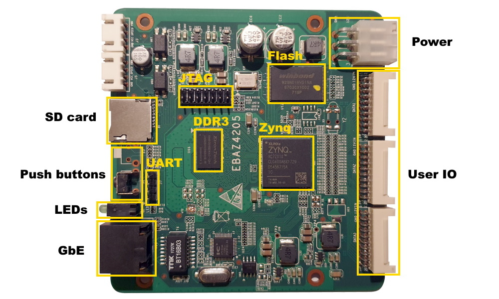
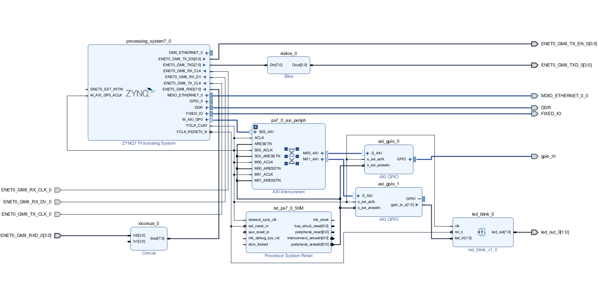

# EBAZ4205

EBAZ4205 is mining board used in Ebang Ebit E9+ bitcoin miner machine. This board features 256MB DDR3 memory, 128MB NAND Flash memory, 10/100MBit Ethernet and speed grade -1 Zynq 7010.

** New additions and changes in this fork:
Added project files to reproduce the design.
The basic functionality of the design allows you to turn on and turn off the red LED at the press of the button S2 (by interruption without loading the processor by polling).
Included file in C language with comments for those wishing to modify the software part of the project.
The RTL module included in the design is controlled by software and in turn controls the output to the LEDs. The red is connected to the button, and the green one just blinks constantly.
And also available the Terminal and Ethernet connections.

A fairly detailed manual Getting_Started_with_the_Zynq.pdf has been added as EBAZ4205 Getting Started, Add more Schematics,
Forum link changed to Telegram group dedicated to board EBAZ4205

- Front side of the board

- [Reverse side of the board](Documents/ebaz4205-2.jpg/)
- Project Block Design Diagram

## Documentation
- [Xilinx Zynq Datasheet](https://www.xilinx.com/support/documentation/data_sheets/ds187-XC7Z010-XC7Z020-Data-Sheet.pdf)
- [Xilinx Zynq Technical Reference Manual](https://docs.xilinx.com/r/en-US/ug585-zynq-7000-SoC-TRM)
- [EBAZ4205 Getting Started](Documents/Getting_Started_with_the_Zynq.pdf)
- [EBAZ4205 Pinout] TBU

## Schematics
- [EBAZ4205 Schematics](Documents/Schematics/)
- [EBAZ4205 KiCad Project](https://github.com/xjtuecho/EBAZ4205/tree/master/HW%2Febaz4205%2Fkicad)

## Board files
- [EBAZ4205 Board files](Documents/Board%20files/)

## Reference designs
- [EBAZ4205 Base Reference Design](Documents/Base%20Reference%20Design/)
- [EBAZ4205 XDC Constraints](Documents/XDC%20Constraints/)
- [EBAZ4205 Petalinux 2020.1 BSP] TBU

## Mechanical drawings
- [EBAZ4205 3D Model] TBU

## Forum
- [Telegram](https://t.me/EBAZ4205)
