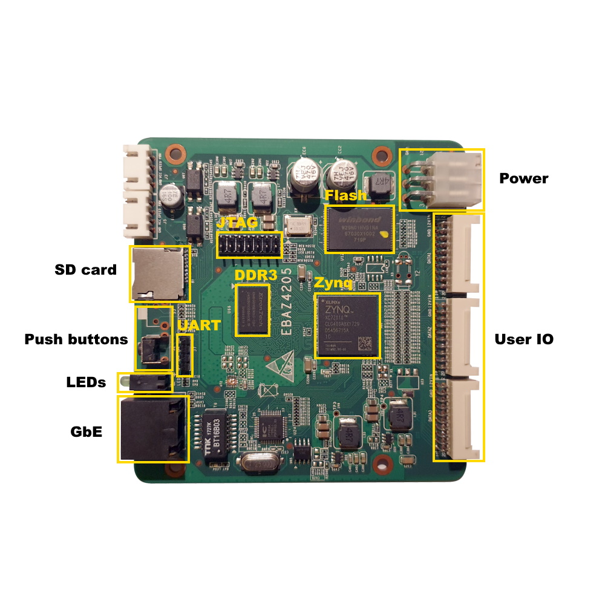

# EBAZ4205

EBAZ4205 is mining board used in Ebang Ebit E9+ bitcoin miner machine. This board features 256MB DDR3 memory, 128MB NAND Flash memory, 10/100MBit Ethernet and speed grade -1 Zynq 7010.

## Documentation
- [Xilinx Zynq Datasheet](https://www.xilinx.com/support/documentation/data_sheets/ds187-XC7Z010-XC7Z020-Data-Sheet.pdf)
- [Xilinx Zynq Technical Reference Manual](https://www.xilinx.com/support/documentation/user_guides/ug585-Zynq-7000-TRM.pdf)

## Schematics
- [EBAZ4205 Schematics](Documents/EBAZ4205_schematic.pdf)
- [EBAZ4205 KiCad Project] TBU

## Board files
- [EBAZ4205 Board files](Board_files/)

## Reference designs
- [EBAZ4205 Base Reference Design] TBU
- [EBAZ4205 XDC Constraints] TBU
- [EBAZ4205 Petalinux 2020.1 BSP] TBU

## Mechanical drawings
- [EBAZ4205 3D Model] TBU

## Forum
- [Forum](https://github.com/XyleMora/EBAZ4205/discussions)
